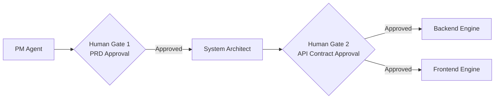

# AI Dev Factory

**Dual-Gate Swarm Orchestrator for reliable AI software generation with human approval at the two highest-risk decision points.**


## Architecture Overview

AI Dev Factory runs as a **Dual-Gate Agentic Workflow**:




### Why the dual-gate state machine matters

- **Gate 1 (PRD Approval)** prevents requirement drift before architecture is generated.
- **Gate 2 (API Contract Approval)** locks integration boundaries before code synthesis begins.
- **State-driven execution** (idle -> running_pm -> review_prd -> running_architect -> review_contract -> running_downstream -> completed/failed) makes behavior auditable and deterministic.
- **Human-in-the-loop checkpoints** reduce hallucinations, enforce intent alignment, and produce outputs that are far closer to production-ready.

## Key Features

- **Resizable IDE-like Workspace** powered by `react-resizable-panels` for Control Center, Agent War Room, and Artifact Workspace panes.
- **Live Inter-Agent Communication Log** with real-time stream indicators (connecting/live/reconnecting/disconnected) and stage-tagged updates.
- **Real-time status polling + event streaming** so the UI stays responsive even during long-running generation jobs.
- **Artifact Viewer** for PRD, architecture contract, and generated code files, including per-file loading and download actions.
- **Human approval controls** for PRD and architecture before downstream generation is allowed.

## Tech Stack

### Frontend

- **React** (UI runtime)
- **Vite** (build and dev tooling)
- **Tailwind CSS** (utility-first styling)
- **Lucide React** (icon system)
- **react-resizable-panels** (multi-pane IDE workspace interactions)

### Backend

- **Python**
- **FastAPI**
- **Microsoft Agent Framework** (`agent-framework`, `agent-framework-openai`) for role-based Foundry-style agent execution
- **Swarm Orchestrator** (multi-agent PM/Architect/Backend/Frontend/Dependency pipeline)
- **FastAPI BackgroundTasks** for asynchronous downstream execution after contract approval

## Foundry Agent Usage in the Backend Layer

The backend uses a role-based agent runtime built on top of `agent-framework` + `agent-framework-openai`, with Azure OpenAI configured as the model endpoint.

### Agent lifecycle and wiring

- `backend/agents/__init__.py` exposes an `AgentFactory` that maps roles (`pm_agent`, `architect_agent`, `backend_agent`, `frontend_agent`, `dependency_agent`) to concrete agent builders.
- Each agent builder in `backend/agents/*.py` loads role-specific instructions from `backend/agents/prompts/*.txt` and creates an `Agent(name=..., client=..., instructions=...)`.
- The shared model client is created in `backend/core/azure_auth.py` via `OpenAIChatCompletionClient` using:
	- `AZURE_OPENAI_ENDPOINT`
	- `AZURE_OPENAI_DEPLOYMENT_NAME`
	- `DefaultAzureCredential` + bearer token provider (`https://cognitiveservices.azure.com/.default`)

This allows every role agent to share the same auth and model deployment while keeping behavior specialized through separate instruction prompts.

### How agents are orchestrated

`backend/core/orchestrator.py` instantiates all role agents once in `SwarmOrchestrator.__init__()` and then drives them through gated stages:

1. PM agent generates PRD text.
2. Architect agent generates API contract JSON.
3. Backend agent generates backend code.
4. Front-end agent generates frontend code.
5. Dependency agent generates `requirements.txt`.

The first two stages are human-gated via API workflow (`start` -> `approve-prd` -> `approve-contract`), then downstream generation runs asynchronously.

### Invocation behavior and resilience

- `_invoke_agent()` in the orchestrator supports multiple method names (`run`, `arun`, `invoke`, `ainvoke`, `complete`, `acomplete`, `chat`, `achat`, `generate`, `agenerate`) to stay compatible with agent implementations.
- Returned values are normalized from common shapes (`content`, `text`, `message`, dict/list wrappers).
- Network and endpoint connectivity failures are caught and rethrown as actionable `SwarmExecutionError` messages that include host-level troubleshooting guidance.

### Prompt contracts and output normalization

- PM output is normalized as plain text PRD.
- Architect output is parsed as JSON (with code-block extraction fallback).
- Backend and frontend outputs are expected as single code blocks and extracted before persistence.
- Dependency output is sanitized to valid package lines only (deduplicated, third-party style names).

### Artifact persistence pattern

After each stage, artifacts are persisted to Azure Blob Storage under `session_id/` (for example: `prd.md`, `contract.json`, `main.py`, `app.py`, `requirements.txt`).

- This supports resumable/gated execution between API calls.
- Generated code artifacts can be shared via short-lived read-only SAS URLs.
- The dashboard can fetch stage artifacts independently from long-running generation tasks.

### Configuration requirements for agent execution

For Foundry-style backend agent execution, these environment variables are required:

- `AZURE_OPENAI_ENDPOINT`
- `AZURE_OPENAI_DEPLOYMENT_NAME`
- `AZURE_STORAGE_ACCOUNT_URL`
- `AZURE_STORAGE_CONTAINER_NAME`

Without these values, agent invocation and artifact persistence will fail fast with explicit runtime errors.

### Deployment

- **Azure Web App** for the frontend static app hosting
- **Azure Container Apps** for the FastAPI orchestration backend

## Local Setup

### 1) Backend (FastAPI)

```bash
cd backend
python -m venv .venv
# Windows PowerShell:
.\.venv\Scripts\Activate.ps1
# macOS/Linux:
# source .venv/bin/activate

pip install -r requirements.txt
uvicorn main:app --reload
```

Backend default URL:

```text
http://127.0.0.1:8000
```

### 2) Frontend (Vite)

```bash
cd dashboard-ui
npm install
npm run dev
```

Frontend default URL:

```text
http://localhost:5173
```

### 3) Environment Variables

Create a `.env` file in the repo root (or backend runtime context) with at least:

```env
# Required for backend CORS
FRONTEND_URL=http://localhost:5173

# Backend runtime
PORT=8000
DEBUG=true

# Azure + model configuration (required for full agent execution)
AZURE_OPENAI_ENDPOINT=
AZURE_OPENAI_DEPLOYMENT_NAME=
AZURE_SUBSCRIPTION_ID=
AZURE_RESOURCE_GROUP=
AZURE_STORAGE_ACCOUNT_URL=
AZURE_STORAGE_CONTAINER_NAME=
```

## Cloud Deployment Architecture

### Frontend on Azure Web App (Static SPA via PM2)

1. Build the frontend into a static output:

```bash
cd dashboard-ui
npm install
npm run build
```

2. Deploy the generated `dist` folder to Azure Web App (`/home/site/wwwroot`).
3. Start the Node BFF server on Azure Web App:

```bash
npm start
# or
node server/bff-server.js
```

This runs the dashboard BFF (`server/bff-server.js`) so `/api/*` requests are proxied correctly to the backend while still serving the SPA.

### Backend on Azure Container Apps

- Containerize FastAPI backend via Docker.
- Push image to Azure Container Registry.
- Deploy to Azure Container Apps with managed identity + RBAC for Azure OpenAI and Blob Storage.
- Expose secure HTTPS ingress for the orchestration API and event/status endpoints.

The provided PowerShell deployment flow in `infrastructure/deploy.ps1` automates image build/push, container app updates, and role assignments.

## Value Proposition

Most AI code generators fail at reliability because they optimize for speed over control. **AI Dev Factory** flips that tradeoff:

- **Predictable outputs** through explicit, gated state transitions.
- **Higher quality delivery** by forcing human approval at PRD and contract boundaries.
- **Scalable architecture** where downstream code engines can run asynchronously and independently.
- **Production-readiness by design** with real-time observability, artifact traceability, and cloud-native deployment targets.

In short: this is not just an AI code generator, it is a **governed software generation pipeline** built for real teams.
